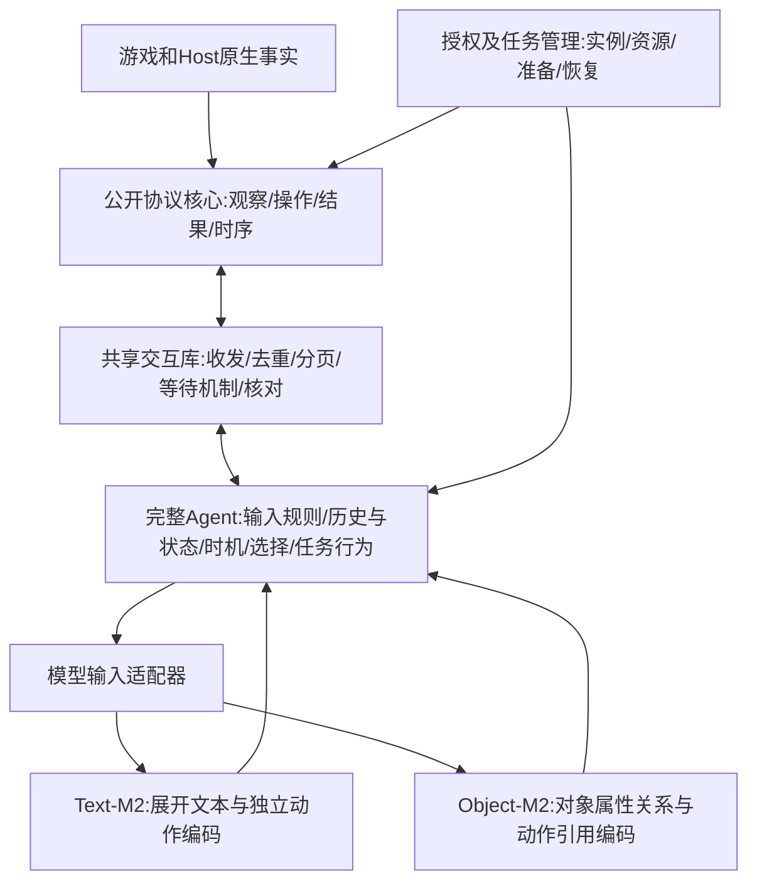

# 暂定候选二：协议给什么，完整Agent怎样接，两个M2怎样计算

最新默认：[采集与缓存详解](BASELINE_CAPTURE_CACHE_DEFAULT.zh-CN.md)。I/F先关闭，首个Model仅消费声明的当前公开观察与W（候选仅供选择评分）；历史动作/receipt不换名塞入P/E，控制侧照常核对。下文I/F能力与旧实现是通用/历史说明，不表示默认启用。新请求式默认区分按需ReadCurrent与已封存ReadSealed，不承诺每个早期通知都已有全部历史内容。

日期：2026-10-08。版本：BND2-M2-0.1。状态：用户暂定职责分配候选二；具体信息/动作/时序、共享库边界和模型选择仍是设计候选，G1未批准。本文细化[RC2边界方案](BASELINE_G1_AGENT_BOUNDARY_AND_BUDGET.zh-CN.md)，不把暂定BND-2提升为整个D01或G1接受。没有新增生产模型、训练、数据使用或游戏操作。

## 1. 一句话理解整条链

协议把**当下允许取得的游戏事实、当前操作关系、事件和真实结果**交给完整Agent；共享交互库处理共通的收发、去重、分页和核对。Agent依据自己的输入规则把资料交给Model计算，再决定提交、查询、等待或停止。两个M2位于同一个Agent架构里的“模型计算组件”位置；它们的输入编码和图不同，因此是两个可替换、独立训练及评价的Agent配置。

这里“原生协议结构”指Host根据原生事实形成的公开结构；不是把STS2内部对象、指针、存档和隐藏字段直接交给Model。公开结构来自原生有依据的投影，它本身也是必须明确设计的合同。



图中两个模型是替代配置，不要求同时运行。共享库可以链接在Agent进程，也可以有会话服务；代码位置不改变规定的输入/输出、权限或行为。外部给Agent初始化/停止信号，Agent可以在其任务范围内结束参与；持有管理能力的Runner仍按RC2另行声明，不因此把存档工具塞进默认游戏策略菜单。

## 2. 协议实际给Agent六类东西

| 类别 | 例子和必要字段 | 进入Model还是由程序保管 |
| --- | --- | --- |
| 当前公开状态 | 当前page/mode、角色与资源、公开对象、数值/文字、焦点/暂选/已揭示预览、对象关系 | 按已声明投影进入Model |
| 当前操作关系 | 当前完整C、动作语义、subject/target等公开引用、参数与已公开标签；可inline或分页 | 两个全评分M2都需要完整C；模型用其语义，不用authority token |
| 已提供事件 | 页进入/退出、公开状态变化、真实own-input及公开反馈；序号和缺口 | 语义内容按consume策略进Model；序号用于程序去重/排序 |
| 请求/结果状态 | 原request明确未投递/已投递/未知；公开pending/completed/cancelled | 公开行为事实可作为后续输入，控制核对由程序处理 |
| 品质与可用性 | complete-for-scope、missing/hidden/unsupported、捕获来源、历史gap | 影响是否可运行；允许的未知/缺失标记也可进Model |
| 会话/任务上下文 | generation、profile/schema、任务目标、权限、deadline、可选管理能力 | 版本/凭据不当策略特征；目标/公开角色/允许预算特征按TaskSpec声明 |

例如卡牌不是只有名字，而是当前公开的实例关系、种类、费用/星费、升级状态、动态正文和已揭示修饰；敌人含HP/block/当前公开意图与状态；商店报价是当前offer的公开字段，不能从卡牌名猜价格。地图节点与可见边是结构；原生内部未来事件或抽牌顺序不进入。

目录动作的引用与当前对象引用可以连接：`focus_target(subject=c1,target=e2)`，或者`select_card(subject=d7,selector=s1)`。字段说明其语义，native owner/operand由协议执行侧保管。模型可选同一合法成员，不自己重新计算合法集合。

## 3. “数据全面吗”必须拆开回答

**目标是在所选协议范围内，信息和操作完整；当前实现还没有被证明全范围完整。** 全面不等于任何时候一次发出游戏中所有可知信息。

| 完整性问题 | 本方案要保证什么 | 不包含什么 |
| --- | --- | --- |
| 当前页完整 | 该逻辑页的全部公开成员和语义，而非只取滚动窗口可见的几个holder | 没进入/没公开的另一个页面 |
| 信息可达完整 | 范围内允许取得的重要资料有明确操作或查询路径，能读取、返回、记录 | 自动替Agent查看所有页面 |
| 当前操作完整 | 当前profile全部真实可输入操作或等价完整关系 | 不同未来mode的潜在操作、任意笛卡尔积 |
| 结构语义完整 | 文字之外的类型、数值、数量/顺序、归属、焦点、选择、预览等有约定 | 只写“card”就声称等同完整原生界面 |
| 历史完整 | 对该Agent声明的consume序列，不漏required occurrence；缺口明确 | 人的心理知识、未录内容的事后伪补 |
| 模型使用完整 | 编码器确实接收声明字段/全部候选，超限不静默截断 | 保证模型理解了、记住了或选得好 |

打开弃牌堆前，Agent可以知道公开牌数和过去经历；是否知道里面每张牌取决于实际历史及信息政策。打开以后得到完整公开成员；回到战斗后Model可能通过W记住，但协议无需每步自动重复发送全部旧页。另一种允许自动查询/聚合的profile也可设计，但需改变曝光、成本与数据投影合同。

如果字段明确隐藏，hidden本身是正确信息；如果本该给的字段没捕获，missing/unsupported就是缺口。必需信息缺失不能标complete；任务可接受的非必需未知可以带mask运行。这些状态与“模型能力不足”分开。

## 4. 一份具体状态和交互过程

下面是示意结构，数字/对象为说明用，不是新gameplay样本；动作只展示片段，实际C必须完整。

```text
Frame
  page = combat_target
  public player = {hp: 40, max_hp: 70, energy: 3}
  entities:
    c1: card {name: 示例牌, cost: 1, text: 当前公开正文, upgraded: false}
    e1: enemy {hp: 28, block: 0, intent_text: 当前公开意图}
    e2: enemy {hp: 17, block: 6, intent_text: 当前公开意图}
  relations:
    c1 held_by player
    current_focus c1 -> e1
  selected_preview = {card: c1, target: e1, text: 当前实际公开的目标预览}
  actions片段:
    a1 = focus_target(c1,e2)
    a2 = confirm_target(c1,e1)
    a3 = cancel_card(c1)
  public changes = 本次已经发生的焦点/预览变化
  basis/quality = 当前generation、Frame/C身份和完整性
```

完整Agent收到后，共享库验schema/序列并准备不可变事件包，Agent的输入适配器编码一次语义occurrence；记忆更新后，时机策略允许chooser读取完整C。模型给分，Agent选择a1，库按原依据提交。游戏真实切换焦点后，新Frame包含e2的实际预览，才能成为下一次模型输入；不能预先算出未公开结果放进旧状态。

接下来Agent可以confirm或cancel；确认后回执可能是delivered/pending。游戏打开child selector时，Agent接收新页并选择child，不等待父牌canonical完成。若断线不能确定投递，就由共享核对机制查询原request；不能模型再选一次相同牌来补偿。明知未投递stale则重新取观察、重新选择。

相同库还服务奖励重访、地图选路、商店报价更新、营火、事件和终局。与哪一个Model搭配无关；换模型不更换游戏规则或原生绑定。

## 5. 完整Agent还有哪些组件

| 组件 | 做什么 | 不能暗中做什么 |
| --- | --- | --- |
| AgentSpec/加载校验 | 固定模型、schema、表示、状态、时机、选择、限制和任务能力 | 仅换权重文件却沿用不兼容旧输入身份 |
| 共享交互客户端 | 收发、只读重连、去重、目录完整分页、Await机制、请求核对 | 替选动作、改曝光、静默丢事件、重试unknown mutation |
| 公共输入投影与模型适配器 | 选择已声明字段，转文本或对象张量，保存引用映射 | 读取底层隐藏信息、当前label或未来结果 |
| 状态/历史管理 | 保存W、短期缓存、组件cursor/reset；按契约重放 | 将重传当新经历、将gap说成连续 |
| 时机策略 | 决定何时调用chooser、查什么、等什么 | 被共享库升级偷偷替换；与超时机械机制混淆 |
| Model | 编码、更新W、计算当前候选分数；可扩Z/O头 | 持有控制权限或直接执行native输入 |
| 选择策略 | 对分数按登记的argmax/采样规则选择，产生明确选择记录 | 用固定fallback改善成绩却不记Agent版本 |
| 请求/结果处理 | 绑定当前C、更新真实公开行为历史、处理stale/pending/unknown | 以画面没变推断原请求未发生 |
| 生命周期/资源策略 | initialize/consume/decide/cancel/close，预算、停止、恢复要求 | 用模型reset清除未知delivery事实 |
| 运行记录/诊断 | 保存实际输入/行为/控制来源、成本和错误 | 把每个内部查表写成Human gameplay decision |

共享库提供某些组件的代码，AgentSpec决定完整运行组合。因此“模型很小”不等于完整Agent没有其他工作；这些程序组件也影响表现，必须记录版本并纳入整体评价。默认两模型对比固定共同程序，以免把外壳差异误当模型优势。

## 6. 模型T：文本状态LightAction M2

简称T只用于本文，不改既有图/schema名称。实际输入：

```text
P_t: 状态/事件展开文字 -> train-only state tokenizer -> int64[T]
W_old: float[K,384]
I_previous: 已确认且可用的先前实际输入 -> UTF-8 byte tokens，或None
F_t: 本次可用公开反馈 -> state tokens，或None
C_t: 完整候选的独立byte token序列，各A_i=UTF-8字节数+2
```

Agent输入适配器把前述结构变成类似“持有卡牌c1，费用1；焦点e1；e1生命28；当前预览……”的确定性文本。局部引用用于保持对象与候选的一致关系，不输入随机request/hash/native地址。对象名称和公开定义可用，不能只靠隐藏ID猜卡效果。

模型的page encoder（现有scratch默认2层、宽384、6头、FF1536）处理一次P。旧W、页面特征、I_previous和F形成write上下文，固定槽attention/gate产生W_new。每个候选通过独立小CNN编码，再只读同一W_new，经transition/head得到logit。候选及当前训练label不回写W。

`advance(P,W,I,F)->W_new`与`score(W_new,C)->scores[M]`可以合在一个函数调用，也可分开；不能在无标签事件消耗后为score重复advance。现有LightAction的非空F另跑一次core，不是严格一次Transformer；若把F并入P另建输入配方。Model输出W_new和分数，Agent负责后续选择/执行。

现有LightAction图可复用，新的展开renderer/事件adapter/训用接线尚未实现。其原训练器每step有N且feedback=None；另一DSimple序列训练器有无N推进和TBPTT机制，但不是同一checkpoint格式。不能将旧在线ExperimentalDSimple包装改名成新T Agent。

## 7. 模型S：直接消费公开对象结构的M2

S是**新的结构化模型提案**，不是现有LightAction换个JSON字段就完成。它保留M2的“更新持久W、候选只读评分”，把页面长文本encoder替换成对象/字段/关系encoder，并把候选byte-CNN替换成结构动作encoder。依然可以使用对象局部文字，结构化不等于删除卡牌/事件说明。

### 7.1 真正进入模型的张量

| 输入 | 建议组织 | 例子 |
| --- | --- | --- |
| 场景/global | page kind、phase、公开任务/玩家资源、质量mask | 战斗/地图/商店/selector/终局；HP和energy单独数值 |
| 对象类型 | variable-length type/category arrays | card、creature、status、relic、potion、orb、map_node、offer、option、control、preview |
| 数值/分类属性 | 每对象field-key/value/unit/known mask的ragged列表 | cost=1、hp=28、price=75、selected=true；unknown不同于0 |
| 文字属性 | 每字段自己的token片段，带字段角色及owner | card.description、event.body、option.label、intent.text |
| 关系 | `(source_index, relation_type, target_index)`及公开属性 | offer contains card、status belongs_to enemy、map_node connects_to node |
| 顺序 | 仅原生公开且有语义的order/slot | 球先后、药水槽、当前公开展示顺序；无序牌堆不泄露抽取顺序 |
| 事件/过去输入/反馈 | 本次公开变化、先前实际行为及当前可用状态 | focus变化、已知delivery、公开取消；与当前label分离 |
| W_old | `float[K,d]` | 初始可对照K1、d384，不是只能表示K个实体 |
| 候选 | verb＋带参数角色的对象索引/公开scalar/text参数 | subject=c1,target=e2；与selected_card角色不同 |

JSON只是传输载体。确定性的tensorizer把对象ref映射为当前批次的行号，保留原ref→action binding供Agent提交。行号不作为可学习身份特征，也不能直接当native operand。Model处理的是有mask的数值、embedding索引、文本token和关系边，不直接执行对象方法。

数值编码包含字段类型、单位、已知mask与声明的尺度变换；可同时保留比例/有界raw通道或signed-log等表示，在train拟合需要拟合的统计。不能把所有未知填0，也不能对极大值静默截断后称无损。实体数量可变，padding只参与计算形状、不参与attention/池化/损失。

### 7.2 一次计算的建议结构

```text
每个实体自己的文字小encoder + 类型embedding + 数值/属性encoder
             ↓ 合并投影
实体表 E0[N,d] + global g[d]
             ↓ 1–2轮带类型的公开关系消息/attention（具体深度待测）
上下文化实体 E[N,d]
             ↓ 与旧W、真实变化/过去输入/反馈做memory write
W_new[K,d]

每个候选:
  verb + role(subject)·E[c1] + role(target)·E[e2] + 公共参数
             ↓ 独立结构动作encoder
  a_i[d] → 查询W_new → transition/head → score_i
```

这是一个具体可实现起点：对象encoder、关系层、memory writer、候选结构encoder和read/score head共同训练。文本局部encoder参数共享，不按每张牌训练一套网络；已知类型可有很小的type-specific投影，但仍共享跨场景交互及memory/head。

本候选的E/W更新不读取候选列表/候选序号/当前标签；当前Frame中真实公开enabled/selected属性仍是合法状态信息。每个候选用自己引用的当前E形成a_i，然后读同一W，不修改E/W。这样既能保留M2历史，又不要求K1独自无损压住200张牌的全部区别。**这是比现有LightAction动作只编码短文本更丰富的新结构分支**，要单独记图和参数成本。

实体关系层只消费公开关系，不是模拟native效果或计算第二套合法性。不能从HP/能量自行扩充C。类型系统不是硬编码卡牌策略；卡牌效果的文字/数字如何有用仍由训练学习。

动作参数采用带角色的变长字段/引用列表，不强制所有动作只有一个subject和target；无对象的back/proceed有empty-role mask，多选/卡包参数保留其ordered/set含义。先前实际动作保留当时公开的不可变语义payload或声明编码，不能只存指向当前E的行号：旧卡/目标可能已消失。不得按同名新对象补绑；训练时重新编码/是否保留梯度随TBPTT规则声明。

### 7.3 同名、顺序、未知和大列表

同名两张牌仍保留两个实例及各自公开修饰/位置；若全部可观察属性真对称，则预测可对称，实际选择由Agent按固定tie规则映回合法实例，不能靠随机hash记住训练标签。跨事件对象连续性只有在source保证时使用，不按同名猜同一对象。

无序集合部分设计为对排列等变，最终同语义结果不因任意序列化排序改变；有意义的手牌显示位置/球顺序则显式保留。关系指针随着重排同步更新。不能把所有数据都池化后丢掉目标对应关系。

未知可选字段可以通过通用field-key＋局部文字表示并标unknown；新必需语义/未知控制类型需要能力拒绝或明确扩展，不能只加一个unknown embedding就宣称仍完整支持。长文本、实体数、边数和候选数各有独立budget；分块必须保留全部声明语义/关系，超限如实报告。新Model不自动消除所有容量上限。

## 8. 结构模型怎样覆盖全场景

场景差别体现在公开对象、字段、关系和C，而不是为每张页面写一个只能处理固定格数的模型。

| 场景 | 对象/关系输入 | 当前动作编码 |
| --- | --- | --- |
| 主战斗与角色资源 | 玩家、手牌、敌人、状态、球、星数、宠物；归属/顺序 | begin_card、potion、end_turn及资料操作 |
| 目标预览 | held card、current focus、实际preview、目标对象 | focus/confirm/cancel，各参数角色明确 |
| 牌组/牌堆与详情 | variable-size cards、pile身份、已揭示属性、upgrade preview | inspect、toggle、back；无原生入口不制造 |
| 单选/多选/nested | selector、eligible对象、暂选状态、公开min/max/control、父child公开关系 | select/deselect/confirm/cancel/Peek，逐次C不枚举所有组合 |
| 奖励/遗物/卡包 | offer/group、linked/independent关系、已揭示内容 | open、choose、return、reroll、claim whole bundle |
| 地图 | 当前可见节点/边、当前/已访问位置、公开目的地类型 | 当前合法travel或close；不预测下一房间真值 |
| 商店 | offer→物品关系、当前价格/库存、金币、移除服务 | buy/open removal/close/proceed，购后新状态 |
| 事件 | 当前event正文、option对象与公开条件/警告 | 选当前option/proceed；未来页不在输入 |
| 营火/宝箱/跨幕 | 当前选项/奖励/reveal阶段和control | 当前native选项及继续，不假设每次仅能选一项 |
| 终局/总结 | public outcome、summary和退出control | summary推进/退出；胜负不同于task结束 |
| 异常/不可操作 | required missing、gap、empty-C原因、控制状态 | Await/Abstain由Agent处理，不给模型伪造一个native wait |

基础全角色A0–A10是目标，结构需表达各角色资源和升阶带来的机制；共享模型不是已具全部能力。完整支持要同时满足协议捕获/操作覆盖、tensorizer字段覆盖、模型图能接受、数据和训练覆盖、实际Agent运行验证五层。不能以“数组长度可变”替代全场景验收。

## 9. 两个模型如何训练、比较和回到Agent

从同一份合格或明确假设的ProtocolTrace出发，采用相同事件曝光、reset、Timing及任务范围：T生成文字输入，S生成对象张量；各自目标都绑定同一真实或声明派生的chosen C成员。输入转换身份分别保存，未来Z/O和当前标签不混入当前输入。探索性有损D转换可以做，但必须分别声明它影响哪些对照条件。

训练顺序为完整prefix或声明截断prefix→每个合格occurrence推进W→有N处对完整C算masked listwise CE→TBPTT按窗口截梯度而不自动清记忆→dev选择→独立test与真实闭环。无N事件仍可推进；全无N chunk不作N optimizer update。对象encoder/关系层/memory/action head都可参与梯度；不把停止梯度的局部encoder效果误称端到端。

先进行结构机制诊断：实体重排＋同步候选指针后分数等变、同名实例区分、unknown/0、候选顺序变化、target不写W、重复/重访、map关系、child选择、所有scope字段映射。然后才用真实数据评价选择、记忆和完整流程。没有这些诊断的漂亮loss不证明输入结构正确。

T与S比较至少固定公开事实、训练来源/split、目标/事件、外层时机/选择规则及任务；分别报告参数、state/局部text tokens、实体/边/候选数、训练预算、时延/峰值内存。S保留本次E给动作引用，T原图没有同一结构路径，因此初次比较是两个完整设计，不是严格单变量“JSON比文本”。需要表示单因素研究时，另做匹配decoder/current-state read与参数预算的消融。

模型输出checkpoint，加上模型输入适配器、共享库版本、Timing/selector、state格式/词表/schema、任务支持和资源要求，才成为完整Agent包。T换S不会改变外部环境协议，却必须换AgentSpec和输入/图身份；不透明复用旧W或旧checkpoint。

## 10. 成本与复用的真实判断

T的长状态core成本主要随T增长，动作另按byte长度编码；上一轮12,480参考BPE的200牌页说明长文本压力。S将数值/类型作为专门特征，局部文字分别编码；若每张牌局部长度L_j，局部attention可约为ΣL_j²而非拼接后(ΣL_j)²，但实体关系层仍有自身成本。全实体dense attention会有N²项；稀疏公开关系消息可随边数增长，带固定诱导槽的全局交互是可选后续方法。都需计d²投影、长事件正文、candidate gather/head及训练反传，不能承诺必然更快。

可以复用来源/use/序列分组、episode/TBPTT/reset、共享客户端与运行记录、部分memory read/head实现。S的新对象tensorizer、局部text/numeric/type encoder、关系层、结构动作encoder和缓存资格要新增。训练时缓存的embedding必须按当前参数/梯度条件处理；推理缓存绑定参数、locale、schema、字段内容和动态上下文，不能按卡名永久缓存。

设计借鉴：[Deep Sets](https://arxiv.org/abs/1703.06114)解释集合与排列性质；[Set Transformer](https://proceedings.mlr.press/v97/lee19d.html)给出集合交互及诱导attention的结构例子。本文没有把它们的理论条件/benchmark表现当作STS2能力证明，也没有直接采用其整个框架。

## 11. 当前决定与证据

BND-2为用户暂定的职责分配方向；T和S是详细候选，尚未确定先实现哪一个或同时实现。建议让共享协议/Agent框架支持两种输入adapter，先验证共同接缝；Model图各自有明确小实现/数据资格包，不先训练全部模型。

当前只有T的内核及部分旧序列机制可复用；新T完整Agent和S图均未完成生产接入。本文新增结构图与全场景映射是设计，不是执行测试。已有预算是RC2文本fixture，未测S参数量/速度/显存，也不保证全场景策略水平。G1依旧等待用户理解与明确批准。
