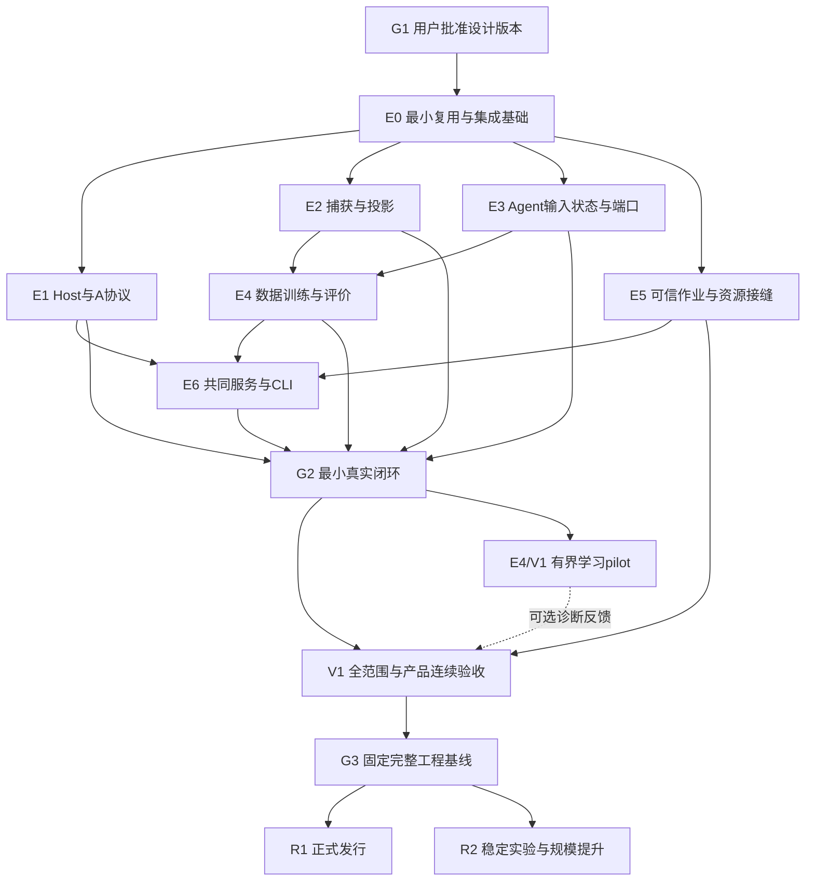

# G1 后从哪里开始：闭环、稳定游戏Agent与研究路线

历史设计材料：当前实施合同已收敛至[BASELINE_V1_SPEC](../BASELINE_V1_SPEC.zh-CN.md)。本文件保留原讨论与证据，不再通过“其余不冲突部分”追加实现义务；旧授权与待选项按当前执行包处理。

最新澄清以[RC2交互边界、模型输入与预算](BASELINE_G1_AGENT_BOUNDARY_AND_BUDGET.zh-CN.md)为准：D01与具体协议仍待确定；比较Host侧、协议核心与Agent侧的职责分配，不预先固定Agent管理能力边界。全角色A0–A10为设计目标，Defect A0为首个验收切片；教程默认由任务准备关闭。

日期：2026-10-08。版本：G1-RC2，待用户理解并批准。使用原19个任务ID；下述E1.1等为已有任务的子包，不另建一套编号。配套[总册](BASELINE_G1_REVIEW_PACKET.zh-CN.md)与[合同C01–15](BASELINE_G1_CONTRACTS.zh-CN.md)。本文是可批准计划，不代表已经派发实现、使用数据或花费预算。

## 1. 先回答“什么时候能做到什么”

| 用户能得到的能力 | 最早合理节点 | 具体含义与仍不能推出的结论 |
| --- | --- | --- |
| 可执行的完整设计及大白话说明 | 本轮G1候选 | 用户读懂并明确批准才通过G1；独立review不能代批 |
| 真正的数据→训练→模型→游戏→评价闭环 | **G2** | 小而真实、可追溯、可重复；不是只跑假环境或成功导出；范围有限 |
| 一款完整封装、稳定接到游戏的默认Agent | G2先在限定范围接通，**V1集成验收**扩至全部首发范围 | 稳定加载、历史/动作/结果、停止恢复、界面/产品链完整；模型可能仍很弱 |
| 大致顺畅自主走完全部主要流程 | **V1的reference-Agent连续性门；G3封存** | 同一reference Agent在声明各主要流程有自主证据；不靠人工替选走过；自然死亡也需正常终局，不等于赢一局 |
| 开始有意义地改善模型 | **G2后** | 固定已合格子范围可做有界pilot/消融；先不声称全游戏普遍有效 |
| 稳定运行多个可比较实验并产出结论 | E4/E5实验服务合格后可在限定范围做；**G3后R2主线**扩规模 | 数据/use、训练seed、环境起点、预算、对照和统计固定；未必每次进步 |
| 向最强STS2模型持续推进和扩展 | **R2循环** | 可靠迭代条件与证据驱动扩展；没有任何工程gate保证最强或给固定胜率日期 |
| 他人正常安装使用、可靠更新回退 | V1预发布候选验证，**R1正式发行** | G3工程闭包之外，还需渠道、实际安装/服务与用户签收；不是merge即部署 |

“全部主要流程”不等于所有随机局都遇见每个罕见Hook，也不等于全卡池无限枚举通过。资格需要两种互补材料：场景/机制覆盖矩阵检验可达能力，连续自然局检验组合连续性。弱模型早死导致未到达的后段，必须保留未自主到达状态；可以用固定场景起点验证该模型后段能力，但不能把几个片段拼成一局自主通关。

## 2. 依赖图与并行规则

图表示产物依赖，不是要求整块串行等完。共享wire/identity/state/use contracts先固定样例，E1/E2/E3在相同样例上可并行；E5可以先实现资源与job预检，E4可用合法合成fixture开发，真实训练等待E2/E3资格。E6的UI设计可并行，正常操作只调用受验服务；不先造漂亮前端再由它拼业务语义。

E0只解除首条链需要的依赖，不等待所有历史分支收口才启动E1。非冲突源码增量经正常PR持续进入develop；组件源用normal merge保持provenance。每位writer独立topic/worktree，共享合同与BOM各一owner；重训练/构建slot按资源限制，任务数不是并行能力。

## 3. 批准后第一批具体包

| 子包 | 从何处开始、交付什么 | 依赖/可并行 | 最低验收与停点 |
| --- | --- | --- | --- |
| E0.1 最小复用清单 | 最新develop重新核ref；将e302产品候选、762907恢复候选按唯一增量拆解 | 首发；不自动复制全部树 | 每项reuse/adapt/replace/defer、owner和source/test状态；保护旧运行/数据 |
| E0.2 合同实施样例 | C01–15生成生产schema草案、normal/error fixture、版本和迁移表 | 与不冲突E0.1并行 | owning领域与独立审查一致；没改A语义、没倒置依赖 |
| E1.1 A核心 | event publisher、Frame/C、Act双维状态、Await、request ledger、能力Attach | E0.2；可与E2/E3并行 | deterministic race/failure测试、完整C、gap与unknown；之后exact-game与bounded runtime |
| E1.2 原生机制缺口 | 星费/focus显示、逻辑holder可达、Peek/药水hover、selector有效阈值、summary owner等 | 按机制独立修，依实际源复核 | 最低忠实native回归；不以旧已编译证明新显示/执行 |
| E2.1 CaptureSpec | 公共曝光stream、失败attempt账、Human输入及父子/seam/时钟 | 与E1共享事件事实，不共享推断权威 | 正常/漏采/不同append顺序/父child/cancel；源可验但Human待实采 |
| E2.2 Projection/Input | 原件→T/R/H/D轨迹→组件输入→资格/masks/分组 | 契约固定后并行实现，真实资格等捕获 | 有/无N、gap、target泄漏、旧数据拒绝、同源split；不能人为补完整 |
| E3.1 AG01端口 | LightAction内核、新renderer/consume、固定Timing、全C只读score、state/cursor | E0.2 fixtures；不等全原生场景 | 在线离线序列一致、重复/重访/child/停止/恢复；非scorer stub也接同A |
| E4.1 本地学习闭环 | 复用DSimple序列机制到新recipe、准备/run/checkpoint/result/package/eval | E2/E3合同先行；fixture开发可并行 | 数值/目标/mask、恢复身份、产物验证；真实训练须独立用途/预算 |
| E5.1 执行接缝 | trusted workloads、显式target、use/limits、journal/intent/handle、cancel/reconcile | 可早并行；不改研究结果owner | 重复请求、unknown、provider结束但产物坏、权限失效；本地先行 |
| E6.1 用例入口 | 同library的CLI/API、同对象状态/结果；薄UI入口 | 随服务增量并行 | GET只读、重复点击、关闭面板、无人工传ID的最小路径 |

每个包派发前固定exact base/paths/owner、正反例、root/component gates、是否包含build/install/game/Human/训练/费用授权、输出证据和停止条件。设计批准本身不隐含上述运行授权；后续可一次授权完整有界包，不逐命令请求。

### E0对现有资产的处置原则

- develop/current设计源是工程入口；产品e302含大批已审查但未集成增量，只择所需能力重验。原安装/运行证据按原identity保留，源码吸收不继承资格。
- recovery762907在`python/tools/m2_campaign`有自己的journal/预算/transition规则，不是新A通用恢复；unknown不自动重发的边界保留。
- Recorder、Evidence、ArtifactStore/Registry/RunReporter、use/Gold、可信adapter/launcher、native bindings、Host服务、UI用例已有基础优先复用；不要建第二份业务数据库或native legality。
- 老模型可原条件重现或显式初始化新run，不因兼容成本默认重训，也不把旧权重强贴新profile。旧PR清理在唯一增量、证据和替代关系明确后由授权包完成，不作为早期第一目标。

## 4. G2：第一次小而真实的闭环怎样验

**目标范围建议：** 同一exact A环境中覆盖一个有实际选择的战斗段，以及一个信息重访或nested selector段；至少一段新Human capture验证目标曝光与输入链，训练可用另外已有合格来源补足。不是要求人类当场一小段就独立构成train/dev/test。Agent运行是单独实例/控制segment，不伪称Human行为。

必须能沿父来源读回：原件→Verification→Projection/资格→固定train/dev数据→SequenceInput/targets→有界真实N训练→checkpoint/validator→Agent包→Host绑定/加载→实际Agent操作/公开结果→停止确认→评价报告。

| G2项 | 通过证据 | 未通过例子 |
| --- | --- | --- |
| 真实来源与用途 | 新capture链及质量；所有训练来源权限/分组/masks，缺口可定位 | 用合成替Human、只保存成功canonical、忽略中途起点 |
| 真训练与产物 | 实际数值训练过程、配置/成本/checkpoint、独立结果验证 | 只导出随机权重、CPU工程overfit冒策略改进 |
| 真回到游戏 | exact包/Host/输入匹配，已授权小任务真实动作/回执及stop | fake Env通过、只load没动作、receipt冒Commit/S' |
| 序列一致 | 真实合法前缀在线/离线相同consume语义；重访/无N/父child | target提前写W、重复写、旧cursor或feedback不一致 |
| 失败可解释 | stale/重复ID冲突/gap/clock/unknown/Stop、半产物/坏checkpoint的忠实回归 | 测试通过但真实owner未调用、自动重试未知投递 |
| 可复做 | 另一干净运行上下文依据manifest复核/执行同范围，重跑有新run ID | 依赖作者私有手动拼路径/聊天隐含配置 |

真实未知投递不能故意无授权制造损害；关键故障用最低忠实组件/进程边界注入，清楚标注未做的live故障。G2需要至少一次实际正常停止释放，故障组合按风险在V1补齐。G2不强求全部L64、云和全部GUI完工；同样也不能因此宣布完整1a产品验收。

G2交付一个closed-loop receipt，列exact输入/产物/原生身份、范围、成功/失败/未知、复现方法及非声明。独立审查后只接受该小范围，不自动允许扩大数据/预算。

## 5. V1：从小链扩成顺畅的主要流程

V1分三个可并行、最终汇合的验收视角，不新增主任务ID：

| 视角 | 必须做到 | 不可替代 |
| --- | --- | --- |
| 环境/记录覆盖 | L01–64、SX01–21、SC01–16适用矩阵；父child、自动/空选/取消、信息/终局、Human来源 | 不能因默认模型从没走到某页，就不验那页 |
| 默认Agent连续性 | 同一固定AG01在主要页面能接续、选取、记忆、完成或正常死/退出；列循环/超时/接管 | 强脚本、人工替选可以诊断环境，不能冒AG01自主完成 |
| 产品/执行 | A–H主要用例、游戏内可达、本地与一个指定远端例子、权限/下载/恢复/更新 | CLI能跑不等于普通用户无需终端；云成功不代本地离线 |

机制缺口先targeted canary，再逐段扩，最后连续自然任务。每个主要族至少有该Agent自主输入到本族合法退出/终点的实际证据；可从获准场景起点开始，但标scene-start。另有从首个局内选择起的连续自然局到已知胜负与summary退出；不得将scene-start片段或人工补段拼成from-start run。

“顺畅”涉及两种失败：协议/实现使合法操作无法继续，由工程owner修；Agent在完好接口上循环、长期不做有用选择或频繁预算停，由Agent/学习owner修。保护机制及时停止是安全成功，但该次任务仍不算自主顺畅完成。如果弱模型只会很早死，工程G3可以在明确策略局限下封存，但“覆盖全部主要流程的默认Agent”这一子门保持未通过，不能使用完整措辞；需要用户接受缩小发行声明或继续改善reference。

### V1测量与拟议验收阈值

这些是**供G1批准的后续验收规则**，不是本轮成绩。数值有不同性质，必须区分。

| 项 | 建议规则 | 何时验证/怎样避免自欺 |
| --- | --- | --- |
| 语义正确性 | 所有声明mandatory case均有匹配证据；隐藏泄漏、伪完整目录、旧动作重绑、unknown重试、伪因果、target泄漏出现即否决 | G2反例→V1真实组合；0次观察错误不证明永远无错 |
| 流程稳定性 | 冻结版本的30个预登记连续attempt，0个可归责系统缺陷导致的失败；全部attempt保留，游戏自然胜/负正常结束均可算工程流程完成 | 提议的工程烟测规模，非“已证99.9%可靠”；如有缺陷修复换candidate并保留旧批结果，不能只挑30成功 |
| 主要流程自主性 | 每个mandatory主要族有AG01自主进入后正确接续/离开的证据，覆盖from-start与scene-start来源；关键循环/挂起未修不通过 | 单独列模型行为和环境driver，不能以两者混合通过 |
| 控制响应 | 沿用旧产品建议：健康本机反馈目标250ms；无在途native提交时release目标1s | 先G2测量可行性，V1前固定资源/测法/阈值；在途结果另判，超时不伪造释放 |
| 其他延迟/吞吐 | 固定硬件/Host/模型/目录规模下测capture、传输、consume、推理、submit、落盘p50/p95/p99与实际机会错失 | G2 pilot估算→确认V1限额→冻结评估，不先编一个通用推理毫秒数 |
| 资源有界 | 缓冲/单payload/任务资源有显式上限；正常声明负载下无required事件gap；超载诚实报gap并停相应资格 | 正常与故障负载分开；不能为吞吐静默丢记录 |
| 数据可信度 | 所用样本100%有来源/use/资格/mask；每种目标报告独立来源和拒绝分母 | 不要求所有原始数据100%可用于所有任务 |
| 恢复/产品 | 每种声明恢复能力有正常及失败路径；无能力明确拒绝；升级配对rollback保护数据 | 不承诺跨任意崩溃透明恢复 |

30次只是有限工程观察：若假设独立同分布，30次零失败的一侧95%成功率下界约90.5%，远不能支持99%或99.9%的宣称；真实相关性可能进一步限制推论。因此本项目用它发现明显组合问题，报告观测率及独立性，稳定性更高声明需另定样本量。主要机制矩阵不能被此30次替代。reference循环/长期空等导致预算终止不算顺畅完成，即使保护机制正确也要保留为Agent失败；该连续性候选批不能存在未修复的此类阻断，不能用工程零崩溃覆盖它。

性能pilot数据不得偷偷成为最终测试；不能见结果不理想后抬阈值仍算同一接受版本。若250ms/1s或resource配置不可行，提交具体测量与取舍修改请求，并更新设计/范围后再测。

## 6. G3：冻结什么，怎样通过

G3接收V1各子门的证据和明确例外，固定：source与组件identity、锁/依赖、wire/Host/profile、Capture/Projection/Input/TargetSpec、数据用途与split、Agent图/词表/权重/程序、task/资源配置、package与实际运行证据、迁移/回退、操作与新人交接。

独立系统review沿一条真实闭环和关键失败路径核对，检查矩阵有没有把source/test/installed/loaded/Human/研究混用。必须存在能稳定使用的reference组合；若主要流程自主子门没过，只能冻结带限制的工程候选，不能称“完整稳定游戏Agent基线已通过”。完成完整G3需要主要流程及产品声明都满足，或者用户明确批准另一个较窄G3范围及名称。

G3不是代码永不改：之后修复要保持兼容和影响分析，更新受影响证据。它也不是胜率门；过了G3不代表N/Z/O/RL有效、不代表优于人类。R1实际发布与R2研究在G3之后可并行，二者不能互签结果。

## 7. G2后怎样稳步改进模型，而不无限等基础工程

建议用两条资源受控的支线：工程支线继续V1覆盖/产品；研究支线在已资格子范围进行E4有界pilot。共享协议/renderer/数据配置变更要冻结配对版本，避免研究天天追latest。大型正式对比在G3稳定闭包上启动；这修正旧任务图容易被理解成“G3前不许任何学习试验”的问题。

| 研究顺序 | 前置资格 | 需要比较和结论范围 |
| --- | --- | --- |
| N学习与数据量 | G2真实N链，source分组与dev/test | 小规模拟合诊断→按独立来源扩大数据；loss/选择质量与实际闭环分别报 |
| M2历史作用 | 同输入/图/训练预算可比、合格历史 | K1/独立Reset-K1，继而K8/独立Reset-K8；推理重置干预另报，不冒独立训练 |
| 表示/骨干 | renderer/信息等价、资源可测 | typed/展开文本；scratch/frozen Qwen/LoRA按真实先验与梯度路径比较；不把信息变多说成结构更强 |
| Z/O辅助 | 分别足量且可信的后继/终点标签 | N/N+Z/N+O/N+Z+O；相同数据/目标有效分母和budget，未执行动作无真反事实 |
| 时机/生成/检索 | 对应完整consumer输入/行为和端口 | 固定Action比Timing；完整C全评分比检索；语法合法不等于策略强 |
| RL与数据闭环 | rollout/reward/time/probability/censor/state恢复及算力预算 | 从已知基线起步，先同步小验证；离线支持偏移与在线探索分别评 |
| 搜索/世界模型 | 合格真实转移或独立模拟器与多步验证 | 预测误差、规划预算、分布外失真和实战收益；不偷偷用隐藏root |
| 泛化与规模 | 原范围稳定、失败可归因、数据/算力瓶颈已测 | 更高难度/角色/版本/多人等逐项扩展profile和benchmark，不混入旧总分 |

不跑所有轴的笛卡尔积。每轮一个主要研究问题、一个匹配baseline和最少必要消融；有证据再扩。候选champion提升是完整Agent而非单个head，记录固定程序、时机/缓存、外部预训练与成本。负结果保留并用于决定不再扩大某路线。

### 多实验的执行和科学验收

ExperimentPlan在开跑前固定问题、primary metric、数据/任务/Host/Agent、train seeds×environment roots、比较对象、采样及停止规则、资源预算、失败处理和checkpoint选择。dev用于选择；sealed test只按计划调用，不能反复看榜调参。相同root配对比较，区间/重采样以独立run/来源group为单位，不以数千动作行伪造样本量。

工程任务成功率、游戏胜率、流程覆盖、干预率、费用/时延并列；没有统一分数掩盖崩溃。游戏自然失败是策略结果，系统异常是工程失败；两者及unknown都报告，排除必须预登记理由。多个训练seed才能评训练方差，环境seed不能替代；样本量由预期效应/区间宽度/预算先确定，少量pilot不作排名定论。

实验服务先支持顺序多个run与manifest对比，再在资源验收后允许有限并发；并发数不是科学质量。每个run隔离state/目录/日志、用途预留、GPU和费用上限；同Host游戏实例不可两个writer抢控制。自动早停可做开发筛选，最终对比须披露被筛选条件和不等预算，不能称同算力公平胜出。

“最强”必须先定义比较域：游戏构建/角色/难度/信息能力/时间与算力预算、公开可复验基线及独立任务分布。不断更新强baseline、冻结champion与challenger盲测、复现提升、保留回归套件，才具备向强模型推进的可靠过程。资料/候选/战斗规则更新时重审benchmark，不承诺任何路线最终必胜。

## 8. 旧Stage1a与本轮路线对账

下表是建议接受的变化；用户批准前不静默覆盖旧文档。

| 既有义务 | G1-RC2建议 | 阶段/未满足时的说法 |
| --- | --- | --- |
| 产品A–H、游戏内黄金旅程和失败恢复 | 保留 | G2只证小链；V1/G3产品能力、R1实际发行签收 |
| 默认D-Simple | 新A下完整AG01/D-M2 N为首reference；保留旧身份 | E3/G2后新资格；不继承旧输入资格 |
| 团队文档仍写旧四模型全场景 | 以默认新Agent全范围＋旧模型兼容/参考矩阵替代强制四模型都重新资格 | 属用户需批准的实质调整；不把历史模型删除 |
| 约一万条合格交互的真实训练尝试 | 保留为既有1a研究义务；不是G2前置也非G3胜率门 | G2后E4/V1可启动有界研究；数据不足就保留该义务未完成，不用合成补数 |
| K1/Reset、K8/Reset、条件Gate/R | 保留研究次序和条件 | 不要求全部模型阻塞第一次工程闭环；1a研究完成另有回执 |
| scratch/frozen Qwen/LoRA，N/Z/O组合 | 保留既有有界1a比较目标，逐项按数据/算力准入 | 没有目标资格时报告blocked/deferred待明确接受，不能偷偷推到1b |
| 旧Public M0/M2/Port4/campaign/recovery | 原条件参考、选择性机制复用 | 不自动重开旧campaign，不迁移旧科学结论 |
| Workshop、其他平台、云真实游戏Host | 渠道/Host独立资格，按需求追加 | 不作为本机小链隐含前置；已承诺产品范围不能删后称全交付 |
| 主线转入1b | 无预算设计/盘点可并行；主要执行资源转移仍需用户验收1a工程与研究处置 | G3工程完成不自动等于所有1a研究目标完成 |

因此有三个完成状态：G3工程基线、R1产品正式交付、既有1a研究义务。它们相关但不应相互隐藏。可以报告“工程基线就绪、某研究门尚未满足”，不能笼统宣布一切完成。

## 9. 每一阶段怎样交接与退回

每份gate receipt必须包含候选身份、接受范围、每项claim/证据层级、完整attempt/失败/unknown、资源/数据用途、复现方式、reviewer和接受者、例外及下一授权。缺事实退回owning E子包；缺设计则版本化修C合同，不让实现者私自降目标。跨多个层的同一因果修复可同包，避免多层互相甩锅。

G1只在用户读懂并明确批准后标accepted；G2/G3由各事实owner提供证据、独立review核组合，再按批准的接受角色确认。涉及新游戏/Human、真实训练、预算、安装/部署或发布时，任务包必须有其授权；已有完整包授权内的正常步骤无需重复请示。

先做有证据的必要工作、持续集成、最小忠实验证；不无限全仓审计、不为每个小修复重跑所有历史实验。主动工作可持续，纯等待约五分钟转为独立任务/如实交接，不伪造后台监控或取消他人作业。
